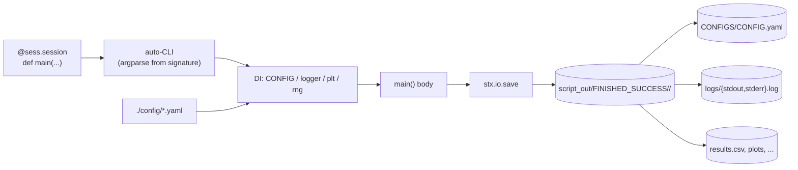
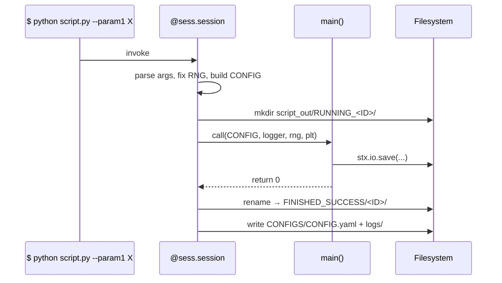

# scitex-session

<p align="center">
  <a href="https://scitex.ai">
    
  </a>
</p>

<p align="center"><b>`@session` decorator + lifecycle (auto-CLI, output dir tree, randomstate, configs).</b></p>

<p align="center">
  <a href="https://scitex-session.readthedocs.io/">Full Documentation</a> · <code>uv pip install scitex-session[all]</code>
</p>

<!-- scitex-badges:start -->
<p align="center">
  <a href="https://pypi.org/project/scitex-session/"></a>
  <a href="https://pypi.org/project/scitex-session/"></a>
  <a href="https://github.com/ywatanabe1989/scitex-session/actions/workflows/test.yml"></a>
  <a href="https://codecov.io/gh/ywatanabe1989/scitex-session"></a>
  <a href="https://scitex-session.readthedocs.io/en/latest/"></a>
  <a href="https://www.gnu.org/licenses/agpl-3.0"></a>
</p>
<!-- scitex-badges:end -->

---

## Installation

```bash
pip install scitex-session
```

## Architecture

```
src/scitex_session/
├── __init__.py        # public re-exports (session, INJECTED, start, close, ...)
├── _decorator.py      # @session — auto-CLI + DI + output-dir lifecycle
├── _manager.py        # SessionManager (class-style alternative)
├── _lifecycle/        # start / close / FINISHED_SUCCESS dir tree
└── template.py        # boilerplate template for new scripts
```



## 1 Interfaces

<details open>
<summary><strong>Python API</strong></summary>

<br>

```python
import scitex_session as sess

# Decorator — wraps main() with auto-CLI, output dir, configs, RNG.
@sess.session
def main(CONFIG=sess.INJECTED, logger=sess.INJECTED, rng=sess.INJECTED):
    ...

# Manual lifecycle (advanced / internal — prefer the decorator above).
# `_start` is the low-level entry point: `_start(sys, plt, ...)`, NOT a
# decorator. The bare `sess.start` name is deprecated.
sess._start(sys, plt, ...)
sess.close(CONFIG)

# Class-style manager
mgr = sess.SessionManager()
```

</details>

## Demo



## Quick Start

```python
import scitex_session as sess

@sess.session
def main(
    param1="default",
    CONFIG=sess.INJECTED,
    plt=sess.INJECTED,
    logger=sess.INJECTED,
    rng=sess.INJECTED,
):
    """Docstring becomes --help."""
    logger.info("hi")
    return 0
```

## Status

Standalone fork of `scitex.session`. Deps: matplotlib + scitex-dict /
-logging / -repro / -str (already-standalone peer packages).

Decoupling notes:
- `scitex.dict.DotDict` → `scitex_dict.DotDict`
- `scitex.repro.RandomStateManager / gen_ID` → `scitex_repro.*`
- `scitex.str.clean_path / printc` → `scitex_str.*`
- `scitex.logging.getLogger` → stdlib `logging.getLogger`
- `scitex.plt.utils._configure_mpl` → optional via `try/except` with no-op
  fallback (matplotlib uses defaults if scitex umbrella isn't installed).
- `scitex.utils._notify` → optional via `try/except` (silent no-op fallback).

The umbrella package's `scitex.session` import path is preserved via a
`sys.modules`-alias bridge.

## Part of SciTeX

`scitex-session` is part of [**SciTeX**](https://scitex.ai). Install via
the umbrella with `pip install scitex[session]` to use as
`scitex.session` (Python) or `scitex session ...` (CLI).

>Four Freedoms for Research
>
>0. The freedom to **run** your research anywhere — your machine, your terms.
>1. The freedom to **study** how every step works — from raw data to final manuscript.
>2. The freedom to **redistribute** your workflows, not just your papers.
>3. The freedom to **modify** any module and share improvements with the community.
>
>AGPL-3.0 — because we believe research infrastructure deserves the same freedoms as the software it runs on.

## License

AGPL-3.0-only (see [LICENSE](./LICENSE)).

---

<p align="center">
  <a href="https://scitex.ai" target="_blank"></a>
</p>
